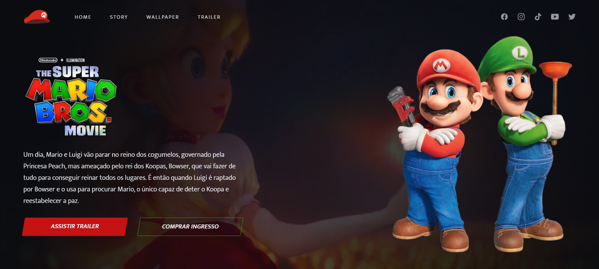

<h1 align="center"> - The Super Mario Bros - </h1>

Em caracter de estudo e aprimoramentos da máteria de frontEnd, elaborei um exemplo de uma página com o tema Mario Bros.
 

  <a href="#-tecnologias">Tecnologias</a>&nbsp;&nbsp;&nbsp;|&nbsp;&nbsp;&nbsp;
  <a href="#-projeto">Projeto</a>&nbsp;&nbsp;&nbsp;|&nbsp;&nbsp;&nbsp;
  <a href="#-layout">Layout</a>&nbsp;&nbsp;&nbsp;|&nbsp;&nbsp;&nbsp;
  <a href="#memo-licença">Licença</a>

  

 

  

##  Tecnologias

Esse projeto foi desenvolvido com as seguintes tecnologias:

- HTML e CSS
- Git e Github
- IonIcons
- Google Fonts
- <a href="https://michalsnik.github.io/aos/" target="_blank">AOS Animate</a>

## 💻 Projeto

O Mario Bros é um pequeno projeto de aprimoramento em FrontEnd.

## 🔖 Layout

Você pode visualizar o layout do projeto através [DESSE LINK](https://github.com/jeffersonmoraesjunior).

## :memo: Licença

Esse projeto está sob a licença MIT.

---

Feito com ♥ by Jefferson Moraes!